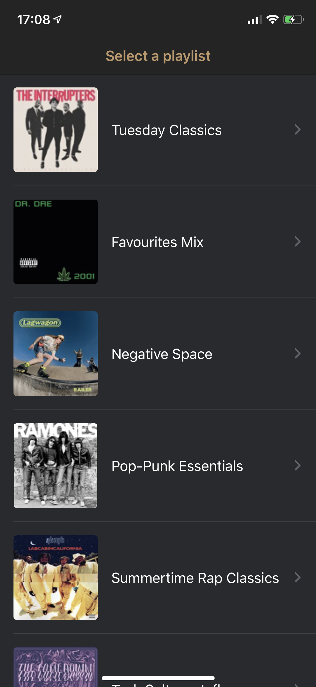
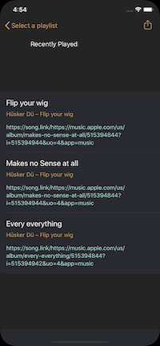

# Scapes

Small project that exports a personal playlist from iTunes / Apple Music as a song.link playlist.

## Why?

Not everyone uses the same music streaming services. If you use Apple Music you can simply use this app to transform your personal curated playlists into a shareable format.

Scapes creates song.link links. Song.link offers a link to the most common music streaming services. Plus it's nice to explore some new features in iOS 13.

## 🚀 Roadmap

- [x] Basic app functionality
- [ ] Single song selection
- [ ] Cache / DB deletion
- [ ] Theme  
- [ ] Clean up  
- [ ] Tests

## 📦 Third Party

- This app uses SwiftLint [MIT License](https://github.com/realm/SwiftLint/blob/master/LICENSE)

## Screenshot

